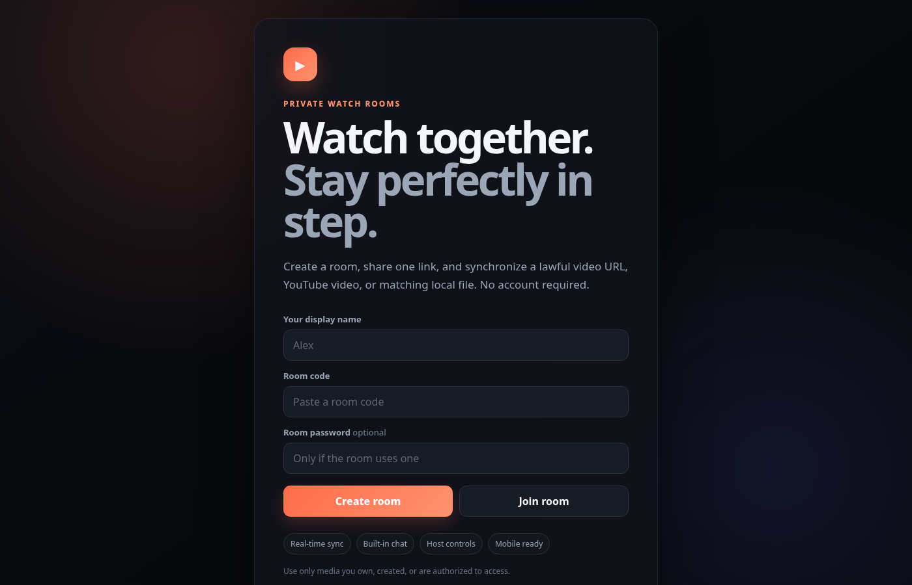

# Watch Together Sync

[](https://github.com/Adam-ZS/couples-stream/stargazers)
[](LICENSE)
[](https://watch-together-sync-1nvh.onrender.com)
[](https://nodejs.org)
[](package.json)

A private, account-free watch-room app for synchronizing media that participants are authorized to play. Share a link, everyone joins, and play/pause/seek stay locked in sync — with built-in chat.

> **Try it live:** https://watch-together-sync-1nvh.onrender.com

## Preview



## What changed in v2

The original project mixed watch-party features with exposed credentials, scraped stream providers, an unrestricted media proxy, and browser/server torrent engines. This rebuild removes those unsafe and unreliable parts and replaces the core with an authoritative real-time room server.

### Features

- Instant room creation and shareable links
- Optional room passwords
- **Direct HTTPS MP4/WebM/HLS playback synced across the room** — no iframes
- YouTube playback through the official embedded player
- Private local-file mode: every participant selects the same file; files never upload
- Server-authoritative play, pause, seek, and speed synchronization
- Automatic clock-offset and playback-drift correction
- Reconnect with full room-state recovery
- Host-only or everyone-can-control modes
- Participant readiness indicators and host removal controls
- Built-in ephemeral chat with bounded history
- Optional TMDB movie/TV metadata search
- Free source search across RamoFlix and DoraBy (server-side, no API keys)
- Free sources resolve to real streams with subtitles (direct-stream player sync)
- Responsive dark interface
- Health endpoint and Render deployment configuration
- Zero npm runtime dependencies

## Free sources (RamoFlix + DoraBy)

The media dialog has a **Free sources** tab. It searches both sites server-side
(WordPress `?s=`), and each result resolves through a locked-down, allowlisted
pipeline to a **real playable stream** — not a dead iframe:

- **`GET /api/sources`** searches both sites.
- **`GET /api/sources/detail`** reads the title's fmovie `Servers` blob.
- **`GET /api/sources/resolve`** turns the detail into a direct stream via the
  vidlove/ballerina API (moviebox → vidapi → ipcloud backends) — a signed MP4
  or an HLS manifest, with 100+ subtitle tracks.
- **`GET /api/stream`** serves the stream through a locked-down proxy: only
  allowlisted hosts, HTTPS only, Referer + browser-style headers for range
  (seek) requests, and HLS manifests rewritten so segment requests go through
  the same allowed proxy. Segment hosts are approved dynamically from parsed
  manifests for 10 minutes — arbitrary hosts stay blocked.
- The resolved stream plays **in the synced player** (so everyone's
  play/pause/seek stays in sync), with subtitles. Embed playback is kept only
  as a fallback for hosts that don't expose a direct stream.

## Requirements

- Node.js 20 or newer

## Run locally

```bash
npm start
```

Then open `http://localhost:8765`.

There are no production packages to download. `npm install` is optional and only creates npm metadata.

## Tests

```bash
npm test
npm run check
```

The integration suite covers HTTP health, room creation, password validation,
WebSocket joining, host permissions, media synchronization, playback
synchronization, chat, media validation, and proxy host allowlisting.

## Supported media

### Direct URL
Use an HTTPS URL to a video file or HLS playlist that the browser is permitted
to access. HLS playback uses a pinned Hls.js build where native HLS is
unavailable. The media is loaded directly by each participant; this server does
not proxy it.

### Free stream
Shared from the Free sources tab — resolved server-side and proxied through the
allowlisted stream proxy (see above).

### YouTube
Paste a normal YouTube, `youtu.be`, Shorts, Live, or embed URL. Playback uses
YouTube's official iframe API. Some videos may block embedding or show ads.

### Local file
The person selecting media chooses a local video. Other participants choose the
matching file on their own devices. A SHA-256 fingerprint derived from file
metadata and small beginning/end samples is compared; the video itself never
leaves the device.

## Deploy to Render

The included `render.yaml` is a ready-to-use blueprint. Click **Render →
New Blueprint** and point it at this repo; Render will pick up `render.yaml`
and expose a `Deployed at` hook. Set optional TMDB variables in the dashboard.

Room and chat state is stored only in process memory. A free instance restart
clears rooms, which is intentional for privacy. For horizontal scaling, add a
shared state/pub-sub layer before running multiple instances.

## Security model

- Room host tokens are random, hashed server-side, and stored locally by the creator.
- Optional passwords are salted and hashed with scrypt.
- User text is length-limited and rendered with `textContent`.
- HTTP and WebSocket message rates and payload sizes are bounded.
- Room, participant, and chat memory are capped and expired.
- Security headers and a restrictive Content Security Policy are enabled.
- There is no general-purpose URL proxy or torrent client; the stream proxy is strictly allowlisted.

See [SECURITY.md](SECURITY.md) for deployment guidance.

## Contributing

Please read [CONTRIBUTING.md](CONTRIBUTING.md) for ground rules, the dev
workflow, and how to report bugs or request features. Contributions are welcome
under the project's MIT license.

## License

[MIT](LICENSE)